<div align="center">

# 🚇 EGY METRO — Business Intelligence Dashboard

**A comprehensive Power BI solution for metro operational analytics**


*May 2026 · ITI Graduation Project*

</div>

---

## 📋 Table of Contents

- [Project Overview](#-project-overview)
- [Demo](#-demo)
- [Dashboard Pages](#-dashboard-pages)
- [Navigation Architecture](#-navigation-architecture)
- [DAX Measures Reference](#-dax-measures-reference)
- [Calculated Columns](#-calculated-columns)
- [Repository Structure](#-repository-structure)

---

## 🔍 Project Overview

The **Egy Metro Management & Analytics Power BI Report** is a comprehensive Business Intelligence solution built on **Microsoft Power BI**, connected to the `EgyMetro_DWH` SQL Server data warehouse. It transforms raw metro operational data into actionable insights that support decision-making across:

- 💰 Revenue streams & financial health
- 🧍 Passenger flow & congestion patterns
- 🚆 Trip efficiency & fleet energy usage
- 👷 Workforce management & payroll
- 📊 Cost control & budget monitoring
- 🎯 Customer behavior & demographics

### Dashboard Summary

| Item | Details |
|------|---------|
| **Tool** | Microsoft Power BI |
| **Data Source** | `EgyMetro_DWH` — SQL Server Data Warehouse |
| **Total Dashboards** | 20 Dashboards |
| **Main Navigator Pages** | 7 |
| **Drillthrough Pages** | 8 |
| **Navigation Button Pages** | 5 |
| **Chart Types** | Bar, Clustered Bar, Line, Area, Donut, Scatter, Gauge, Treemap, Waterfall, Matrix Heat Map, Column, Clustered Column, Pie, Map |
| **Slicers** | Line, Month, Date, Day, Hour, Train Type, Shop Type, Subscription Type, Cost Type, Employee Role, Employee Status, Station Name, Penalty Type, IsPeakHour |

---

## 🎬 Demo

<div align="center">

> **Interactive Dashboard Preview**


*↑ Animated walkthrough of the EgyMetro Power BI dashboards*

</div>

---

## 🗂 Dashboard Pages

### Page Type Legend

| Badge | Meaning |
|-------|---------|
| ★ **Main Navigator** | 7 primary dashboards. Carries slicers and links to related detail pages. |
| ◆ **Drillthrough** | Reached by right-clicking a chart element. Opens pre-filtered. Has a Back button. |
| ▶ **Navigation Button** | Reached by clicking a button on a main page. Opens without an automatic filter. Has a Back button. |

---

### 🏠 Cover Page — Report Entry Point

The first screen users see. Displays the project title, summary, and navigation buttons linking directly to each of the 7 main dashboards.

| Element | Details |
|---------|---------|
| **Type** | Landing / Navigation Page (not counted in the 20 dashboards) |
| **Navigation** | Buttons linking to all 7 Main Navigator Pages |
| **Contents** | Project title & Summary · Navigation button grid |
| **Purpose** | Orients the user and provides one-click access to any main section |


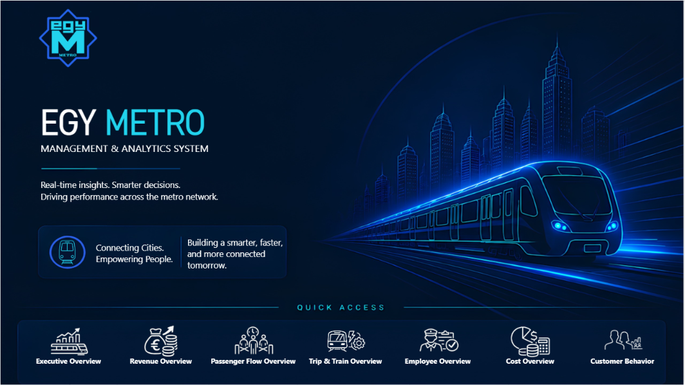


---

### ★ Dashboard 1 — Executive Overview

*The strategic command center of the entire report. Answers whether the metro is financially healthy by placing revenue per line, breaking down income by source, tracking passenger volume over time, and monitoring the cost-to-revenue ratio in real time.*

| Element | Details |
|---------|---------|
| **Slicers** | `Dim_Date[FullDate]` · `Dim_Time[Hour]` |
| **KPI Cards** | Total Revenue · Total Cost · Net Margin · Total Passengers · Total Trips |
| **Chart 1 — Stacked Column** | Which Line Makes Money? |
| **Chart 2 — Donut** | Revenue Sources Mix |
| **Chart 3 — Line** | Passengers By Date |
| **Chart 4 — Gauge** | Cost-to-Revenue Ratio |


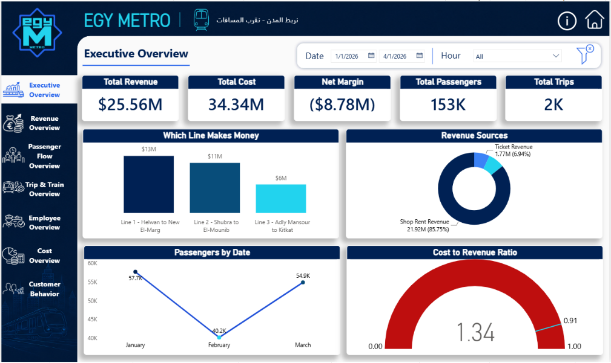


---

### ★ Dashboard 2 — Revenue Overview

*Maps every revenue stream — ticket sales, subscriptions, and shop rent. Identifies the top earning stations, reveals payment method preferences, and tracks subscription revenue over time.*

| Element | Details |
|---------|---------|
| **Slicers** | `Dim_Station[StationName]` · `Dim_Date[FullDate]` · `Dim_Time[Hour]` |
| **KPI Cards** | Total Revenue · Avg Ticket Value · Active Subscriptions · Total Penalty Revenue · Shop Rent Revenue |
| **Chart 1 — Waterfall** | Revenue Build-Up: Shop Rent → Subscriptions → Ticket Sales → Total |
| **Chart 2 — Bar** | Top Revenue Stations |
| **Chart 3 — Donut** | Payment Method Split |
| **Chart 4 — Line** | Subscription Revenue Over Time |
| **Links to** | D8 Ticket Sales Detail (Drillthrough) · D9 Subscription Revenue (Button) · D10 Shop Rent Revenue (Button) |


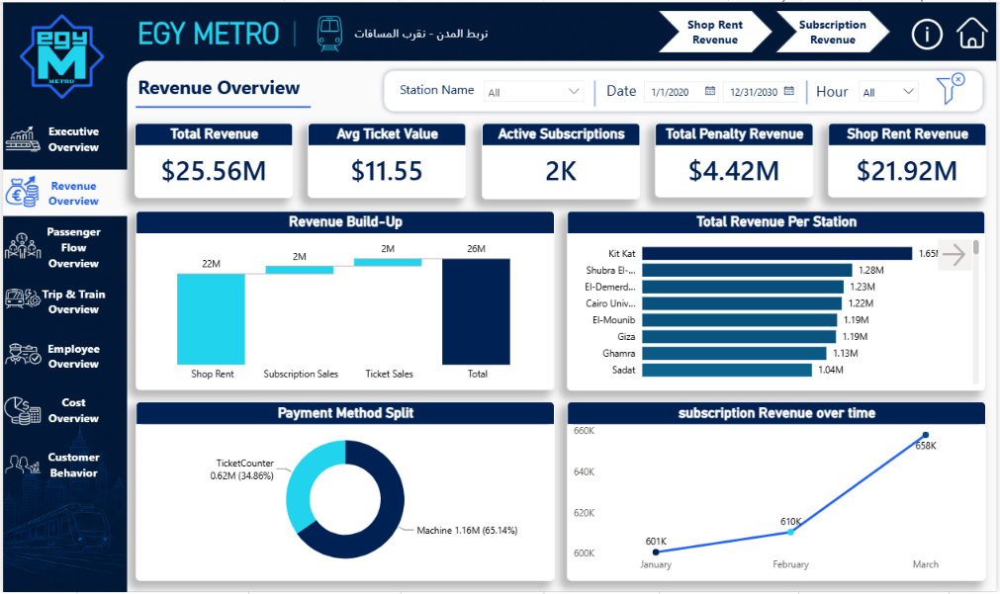


---

### ★ Dashboard 3 — Passenger Flow Overview

*Reveals when and where the system reaches its operational limits. A day-hour heat map exposes peak congestion patterns while a scatter plot surfaces stations that are simultaneously overcrowded and have abnormally long stay times.*

| Element | Details |
|---------|---------|
| **Slicers** | `Dim_Station[StationName]` · `Fact_PassengerUsage[PenaltyType]` · `Dim_Time[IsPeakHour]` |
| **KPI Cards** | Total Entries · Avg Stay Duration · Peak Hour Entries · Penalty Incidents |
| **Chart 1 — Column** | Weekly Traffic Pattern |
| **Chart 2 — Scatter** | Busy & Long Stations |
| **Chart 3 — Donut** | Penalty Distribution |
| **Chart 4 — Matrix Heat Map** | Total Entries by Day & Hour |
| **Links to** | D11 Peak Hours (Button) · D12 Station Congestion (Drillthrough) · D13 Penalty Analysis (Drillthrough) |


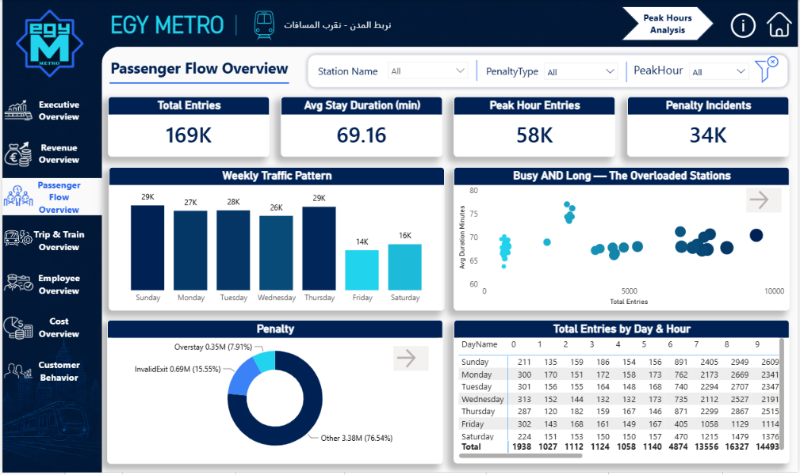


---

### ★ Dashboard 4 — Trip & Train Overview

*Evaluates operational efficiency across lines and the train fleet. Compares trip volume by direction, benchmarks total energy consumption by train type, and uses a gauge to flag whether fleet-wide average energy per trip is within the acceptable target.*

| Element | Details |
|---------|---------|
| **Slicers** | `Dim_Line[LineName]` · `Dim_Train[TrainType]` |
| **KPI Cards** | Total Trips · Total Energy (kWh) · Avg Energy per Trip · Active Trains |
| **Chart 1 — Clustered Column** | Trips by Line & Direction |
| **Chart 2 — Bar** | Total Energy by Train Type |
| **Chart 3 — Scatter** | High Mileage vs High Energy |
| **Chart 4 — Gauge** | Avg Energy per Trip (Target: 450 kWh) |
| **Links to** | D14 Line Performance Detail (Drillthrough) |


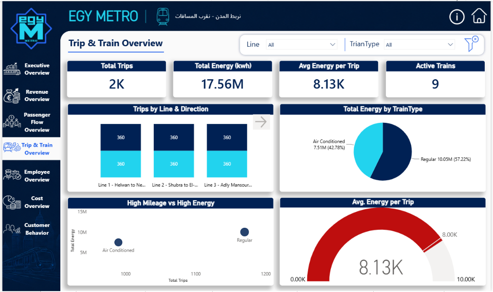


---

### ★ Dashboard 5 — Employee Overview

*Profiles workforce distribution, individual driver productivity, and payroll allocation across stations. Examines whether higher-paid drivers actually complete more trips — a critical input for HR reviews and salary planning.*

| Element | Details |
|---------|---------|
| **Slicers** | `Dim_Employee[Role]` · `Dim_Employee[EmploymentStatus]` |
| **KPI Cards** | Total Active Employees · Total Salary Paid · Avg Salary · Trips per Active Driver |
| **Chart 1 — Donut** | Workforce by Role |
| **Chart 2 — Bar** | Top Drivers by Trips |
| **Chart 3 — Column** | Salary Cost by Station |
| **Chart 4 — Column** | Employees Salary by Role |
| **Links to** | D15 Salary & Workforce Detail (Drillthrough) |


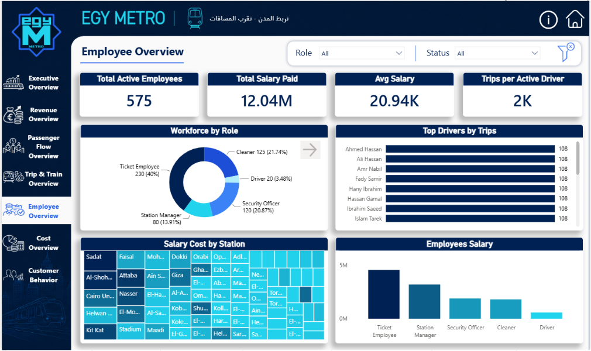


---
<details>
<summary>Show Other Dashboards Details</summary>
    
### ★ Dashboard 6 — Cost Overview

*Maps the complete cost structure of metro operations. Reveals which spending categories dominate, shows cost distribution across types, and tracks escalation trends — the primary tool for budget control.*

| Element | Details |
|---------|---------|
| **Slicers** | `Fact_OperatingCosts[CostType]` · `Dim_Date[FullDate]` |
| **KPI Cards** | Total Operating Cost · Total Salary Cost · Total Station Cost · Avg Total Train Cost |
| **Chart 1 — Donut** | Cost by Type |
| **Chart 2 — Donut** | Cost by Category (Station / Train / Salary) |
| **Chart 3 — Bar** | Most Expensive Stations to Operate |
| **Chart 4 — Line** | Operating Cost Over Time |
| **Links to** | D16 Station Cost Detail (Drillthrough) · D17 Train Cost Detail (Button) · D18 Revenue vs Cost Balance (Button) |


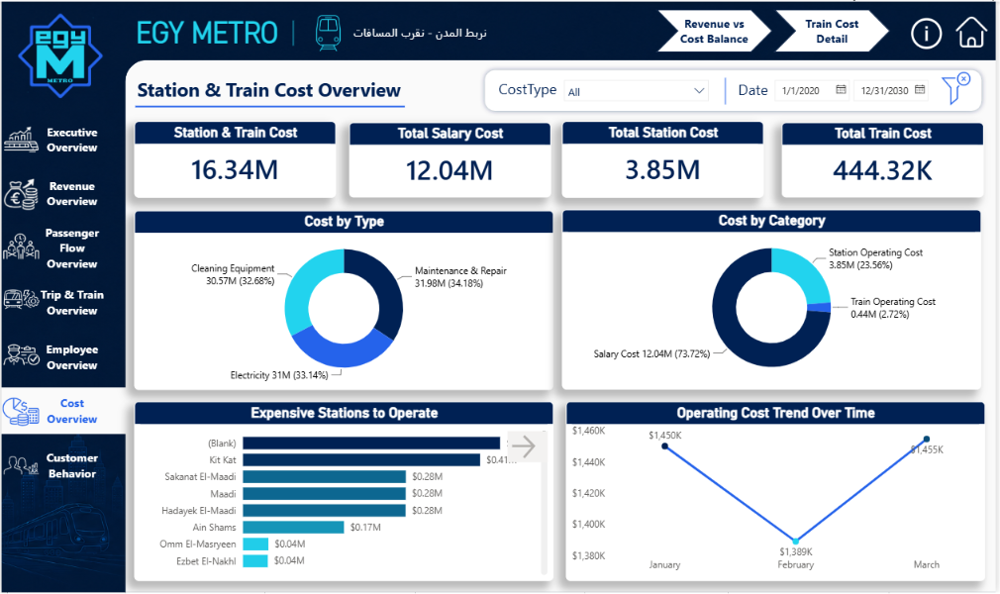


---

### ★ Dashboard 7 — Customer Behavior

*Builds a data-driven portrait of metro passengers across age, gender, nationality, and ticket preferences. Reveals which demographic segments dominate ridership and whether different groups favor different ticket types.*

| Element | Details |
|---------|---------|
| **Slicers** | `Dim_Date[FullDate]` · `Dim_Time[Hour]` |
| **KPI Cards** | Total Customers · Avg Customer Age · Female Passenger Share % · Active Subscriptions |
| **Chart 1 — Donut** | Gender Split |
| **Chart 2 — Column** | Customer Nationalities |
| **Chart 3 — Column** | Ticket Sales by Age Group |
| **Chart 4 — Clustered Column** | Ticket Type Preference by Gender |
| **Links to** | D19 Nationality Profile Detail (Drillthrough) |


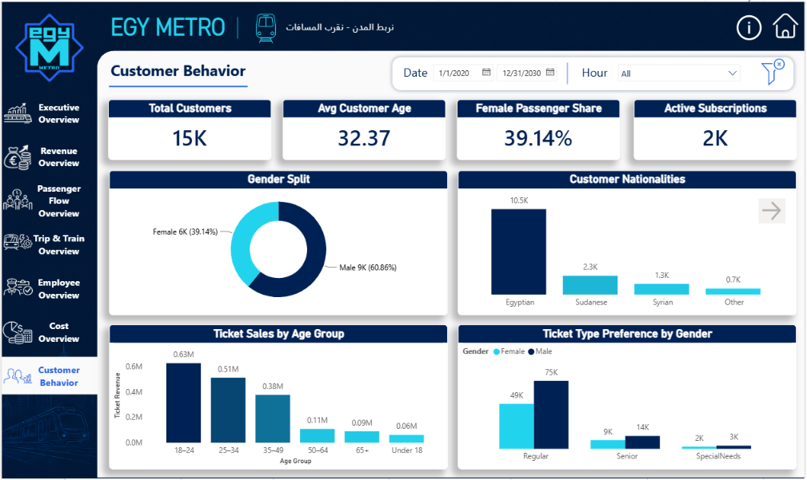


---

### ◆ Dashboard 8 — Ticket Sales Detail *(Drillthrough)*

*A deep dive into ticket performance at one specific station — which types sell most, how many are actually used versus wasted, and which payment method generates the most revenue.*

> **Access:** Right-click a Station bar on Dashboard 2 → select *Drill through* → Dashboard 8

| Element | Details |
|---------|---------|
| **Drillthrough Field** | `Dim_Station[StationName]` |
| **Chart 1 — Column** | Best-Selling Ticket Types |
| **Chart 2 — Donut** | Ticket Usage Status |
| **Chart 3 — Waterfall** | Revenue by Ticket Type |
| **Chart 4 — Donut** | Payment Method Revenue |


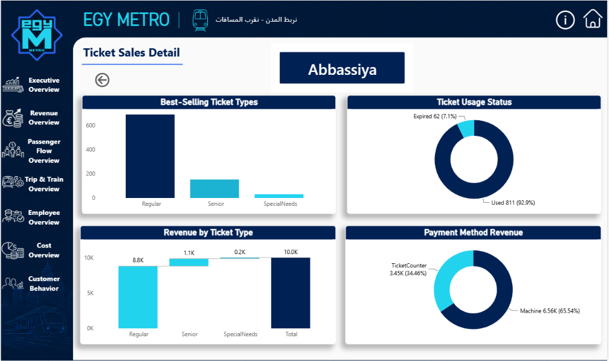


---

### ▶ Dashboard 9 — Subscription Revenue *(Navigation Button)*

*Examines subscription product health in detail — status mix, most popular types, subscriber age group breakdown, and whether adoption is accelerating or slowing.*

> **Access:** Click button *Subscription Details* on Dashboard 2

| Element | Details |
|---------|---------|
| **Filters** | `Dim_Date[FullDate]` · `[SubscriptionType]` |
| **Chart 1 — Donut** | Subscription Status Mix |
| **Chart 2 — Bar** | Most Popular Types |
| **Chart 3 — Column** | Subscribers by Age Group |
| **Chart 4 — Line** | Subscription Growth Trend |


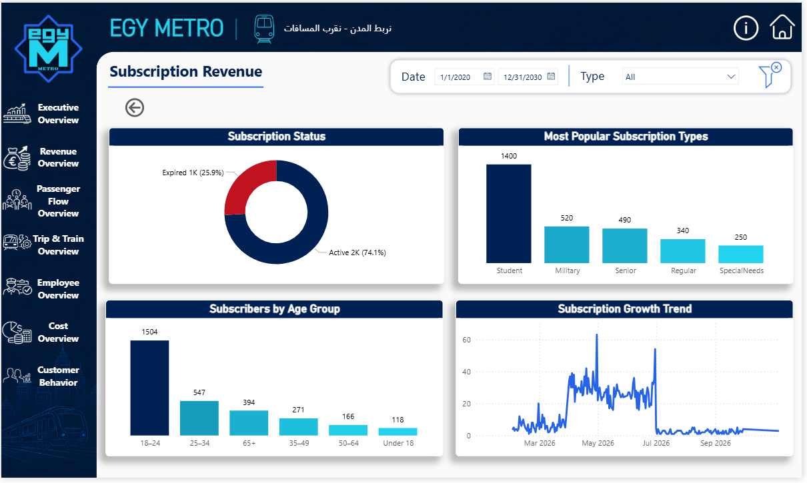


---

### ▶ Dashboard 10 — Shop Rent Detail *(Navigation Button)*

*Analyzes commercial income from shops inside metro stations — most profitable shop types, highest-paying tenants, and revenue distribution across stations.*

> **Access:** Click button *Shop Rent Details* on Dashboard 2

| Element | Details |
|---------|---------|
| **Filters** | `Dim_Date[FullDate]` · `[ShopType]` |
| **Chart 1 — Column** | Rent by Shop Type |
| **Chart 2 — Bar (Top 5)** | Highest-Paying Shops |
| **Chart 3 — TreeMap** | Rent Revenue by Station |


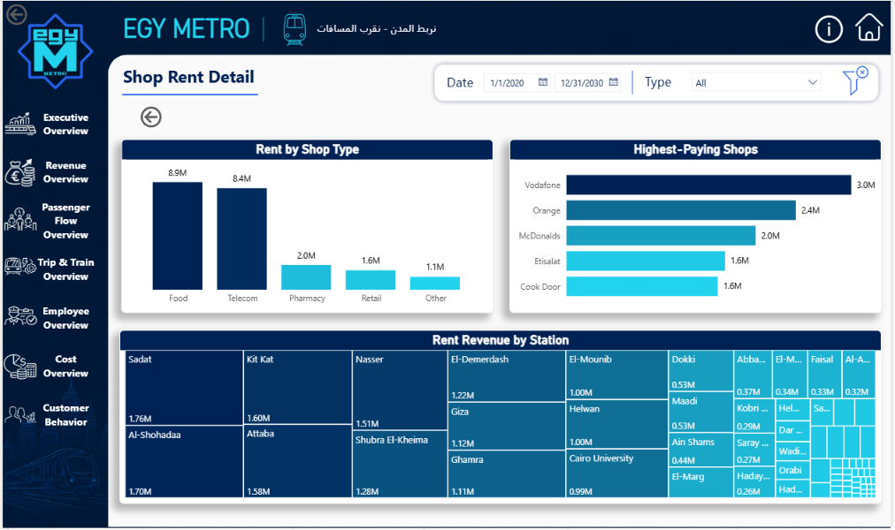


---

### ▶ Dashboard 11 — Peak Hours Analysis *(Navigation Button)*

*Zooms into the exact timing of passenger surges system-wide. Compares AM and PM peak patterns, shows whether weekends shift the rush hour profile — critical for scheduling and staffing decisions.*

> **Access:** Click button *Peak Hours Analysis* on Dashboard 3

| Element | Details |
|---------|---------|
| **Filters** | `Dim_Date[FullDate]` · `Dim_Date[Day]` |
| **Chart 1 — Line** | Passenger Volume by Hour |
| **Chart 2 — Line** | Weekend vs Weekday Peak Pattern |
| **Chart 3 — Area** | AM vs PM Peak Comparison |
| **Chart 4 — Column** | AM / PM Entries by Day of Week |


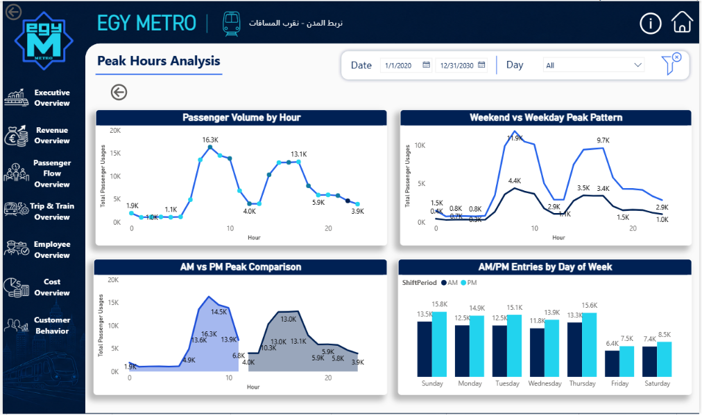


---

### ◆ Dashboard 12 — Station Congestion Detail *(Drillthrough)*

*A focused stress test for one station. Combines a day-hour heat map with journey duration distribution and gate-type numbers to determine whether this station is approaching operational overload.*

> **Access:** Right-click a Station bar on Dashboard 3 → select *Drill through* → Dashboard 12

| Element | Details |
|---------|---------|
| **Drillthrough Field** | `Dim_Station[StationName]` |
| **Chart 1 — Column** | Duration Stayed Distribution |
| **Chart 2 — Donut** | Gates by Type |
| **Chart 3 — Column** | Daily Entry Volume |
| **Chart 4 — Matrix Heat Map** | Hourly Congestion Pattern |


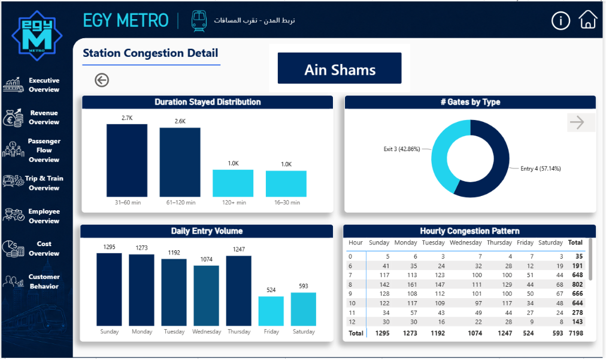


---

### ◆ Dashboard 13 — Penalty Analysis *(Drillthrough)*

*Investigates whether violations are a minor revenue stream or a systemic signal. Ranks penalty types, maps hotspot stations, and compares peak versus off-peak rates to guide enforcement decisions.*

> **Access:** Right-click the Penalty Incidents KPI card on Dashboard 3 → select *Drill through* → Dashboard 13

| Element | Details |
|---------|---------|
| **Drillthrough Field** | `Fact_PassengerUsage[PenaltyType]` |
| **Chart 1 — Column** | Penalties by Hour |
| **Chart 2 — Column** | Total Penalty Incidents by Type |
| **Chart 3 — Clustered Column** | Penalty Type: Peak vs Off-Peak |


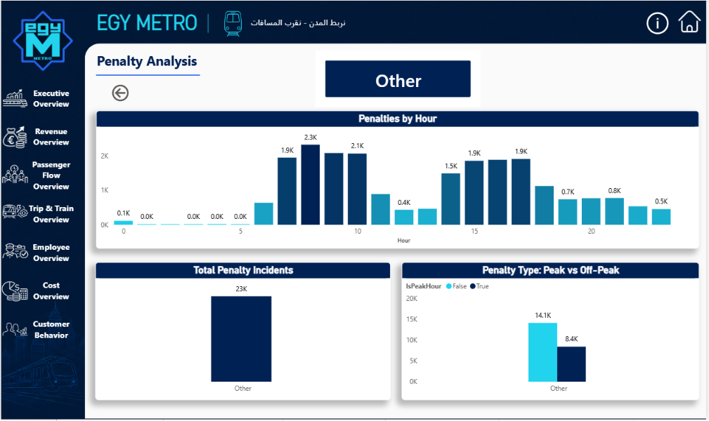


---

### ◆ Dashboard 14 — Line Performance Detail *(Drillthrough)*

*A complete operational profile of one metro line — trip direction balance by month, total trips by train type, and revenue trend.*

> **Access:** Right-click a Line bar on Dashboard 4 → select *Drill through* → Dashboard 14

| Element | Details |
|---------|---------|
| **Drillthrough Field** | `Dim_Line[LineName]` |
| **Chart 1 — Clustered Column** | Total Trips by Month & Direction |
| **Chart 2 — Donut** | Total Trips by Train Type |
| **Chart 3 — Line** | Entries Trend on This Line |


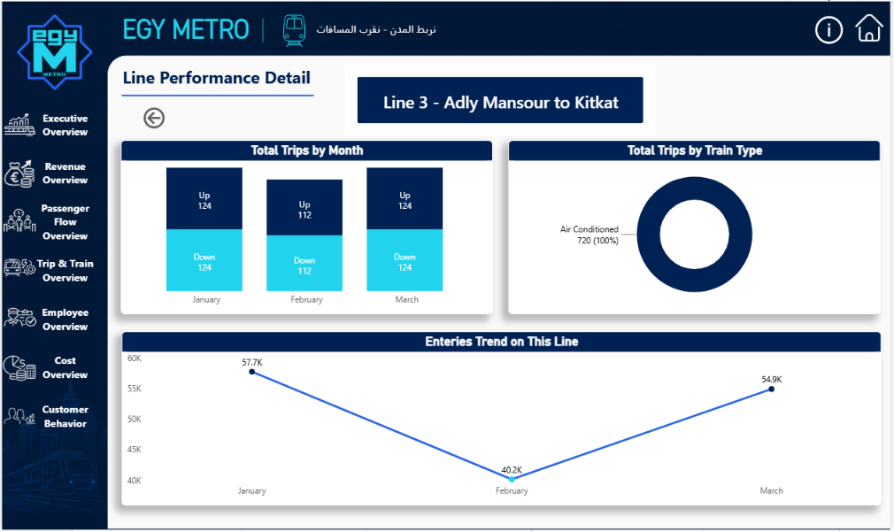


---

### ◆ Dashboard 15 — Salary & Workforce Detail *(Drillthrough)*

*Breaks down payroll allocation by role and station. Reveals gender distribution, compares active versus inactive headcount per role, and identifies which stations carry the heaviest salary burden.*

> **Access:** Right-click a Driver bar on Dashboard 5 → select *Drill through* → Dashboard 15

| Element | Details |
|---------|---------|
| **Drillthrough Field** | `Dim_Employee[Role]` |
| **Chart 1 — Column** | Salary Cost by Role |
| **Chart 2 — Map** | Heaviest Payroll Stations |
| **Chart 3 — Donut** | Gender Distribution |
| **Chart 4 — Column** | Active vs Inactive by Role |


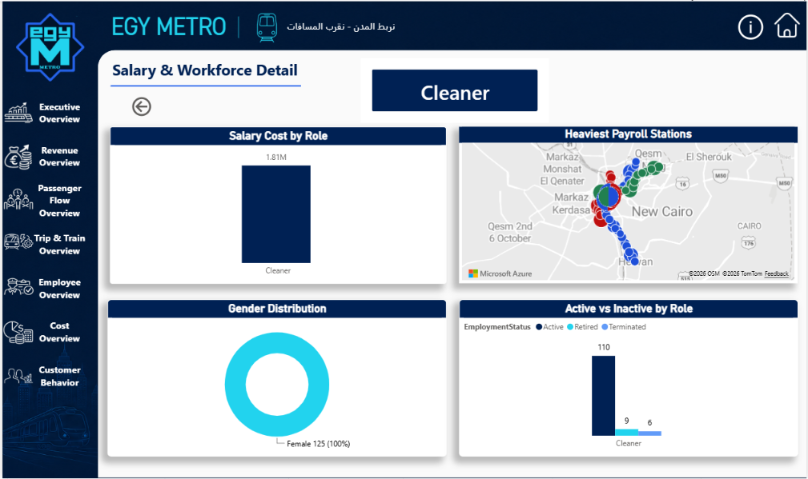


---

### ◆ Dashboard 16 — Station Cost Detail *(Drillthrough)*

*A granular cost audit for one specific station. Identifies dominant cost types and tracks whether spending is rising over time.*

> **Access:** Right-click a Station bar on Dashboard 6 → select *Drill through* → Dashboard 16

| Element | Details |
|---------|---------|
| **Drillthrough Field** | `Dim_Station[StationName]` |
| **Chart 1 — Donut** | Cost Types at This Station |
| **Chart 2 — Column** | Employees by Role at This Station |
| **Chart 3 — Line** | Station Cost Over Time |


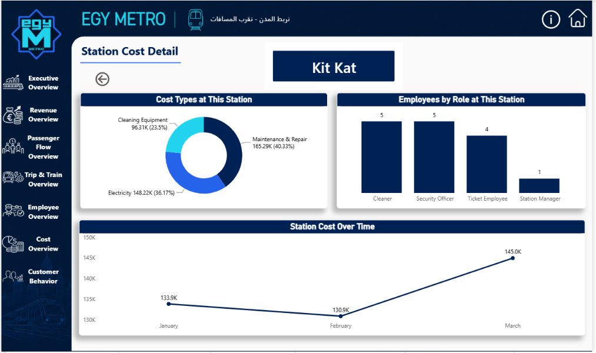


---

### ▶ Dashboard 17 — Train Cost Detail *(Navigation Button)*

*Examines the full cost profile of the train fleet — spending breakdown by cost type, escalation trends over time, and cost comparison across individual trains of the same type.*

> **Access:** Click button *Train Cost Detail* on Dashboard 6

| Element | Details |
|---------|---------|
| **Filters** | `Dim_Date[Month]` · `[TrainType]` |
| **Chart 1 — Treemap** | Cost Type Breakdown |
| **Chart 2 — Line** | Maintenance Cost Escalation |
| **Chart 3 — Column** | This Train vs Same Type Fleet |


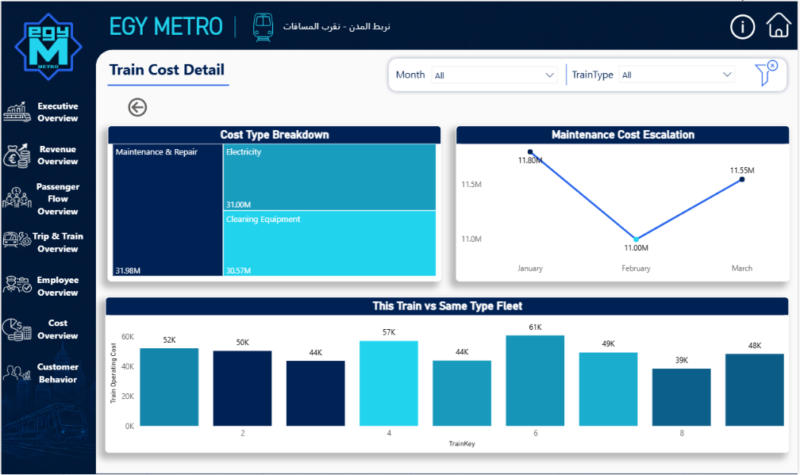


---

### ▶ Dashboard 18 — Revenue vs Cost Balance *(Navigation Button)*

*The ultimate financial accountability view. Shows which lines are profitable and which are subsidized, plots the revenue-cost gap over time, and uses a margin gauge to assess overall profitability.*

> **Access:** Click button *Revenue vs Cost Balance* on Dashboard 6

| Element | Details |
|---------|---------|
| **Filters** | `Dim_Date[FullDate]` · `[Line]` |
| **Chart 1 — Clustered Column** | Revenue vs Cost by Line |
| **Chart 2 — Column** | Net Margin per Line (Green ≥ 0 / Red < 0) |
| **Chart 3 — Line** | Revenue vs Cost Gap Over Time |
| **Chart 4 — Gauge** | Overall Margin Health (Target: 25%) |


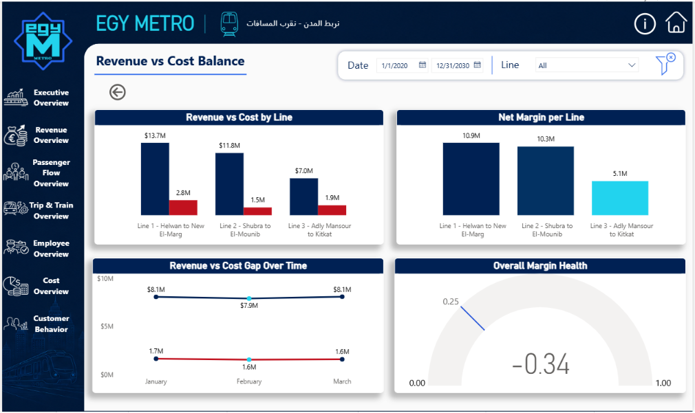


---

### ◆ Dashboard 19 — Nationality Profile Detail *(Drillthrough)*

*A focused demographic profile for one specific passenger nationality — best ticket type, preferred payment method, spending over time, and most used stations.*

> **Access:** Right-click a Nationality bar on Dashboard 7 → select *Drill through* → Dashboard 19

| Element | Details |
|---------|---------|
| **Drillthrough Field** | `Dim_Customer[Nationality]` |
| **Chart 1 — Column** | Ticket Type Purchased |
| **Chart 2 — Donut** | Preferred Payment Method |
| **Chart 3 — Line** | Spending Over Time |
| **Chart 4 — Map** | Most Used Stations |


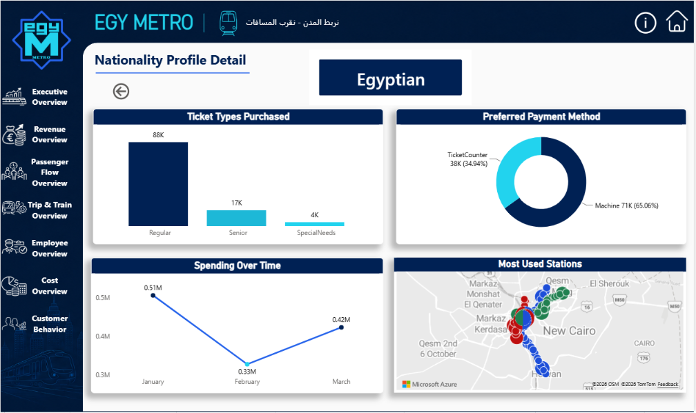


---

### ◆ Dashboard 20 — Gate Activity Detail *(Drillthrough)*

*Analyzes traffic through one specific gate — hourly patterns, day-of-week variation, and whether peak hours generate disproportionate penalty rates.*

> **Access:** Right-click a Gate element on Dashboard 12 → select *Drill through* → Dashboard 20

| Element | Details |
|---------|---------|
| **Drillthrough Field** | `Dim_Gate[GateID]` |
| **Chart 1 — Column** | Hourly Traffic Through Gate |
| **Chart 2 — Bar** | Day of Week Usage |
| **Chart 3 — Column** | Peak vs Off-Peak by Day |


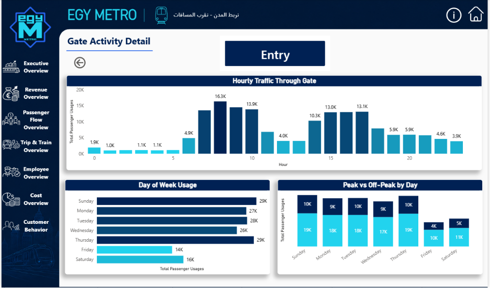

</details>

---

## 🗺 Navigation Architecture

The report is structured in three layers to give users both a high-level strategic view and deep granular analysis without cluttering any single page.

| From | Element | Type | Filter Field | Target |
|------|---------|------|-------------|--------|
| D2 Revenue | Station bar | ◆ Drillthrough | `Dim_Station[StationName]` | D8 Ticket Sales |
| D2 Revenue | Button | ▶ Navigation Button | None | D9 Subscriptions |
| D2 Revenue | Button | ▶ Navigation Button | None | D10 Shop Rent |
| D3 Passengers | Button | ▶ Navigation Button | None | D11 Peak Hours |
| D3 Passengers | Station bar | ◆ Drillthrough | `Dim_Station[StationName]` | D12 Congestion |
| D3 Passengers | Penalty card | ◆ Drillthrough | `PassengerUsage[PenaltyType]` | D13 Penalties |
| D4 Trips | Line bar | ◆ Drillthrough | `Dim_Line[LineName]` | D14 Line Perf. |
| D5 Employees | Driver bar | ◆ Drillthrough | `Dim_Employee[Role]` | D15 Salary |
| D6 Costs | Station bar | ◆ Drillthrough | `Dim_Station[StationName]` | D16 Station Cost |
| D6 Costs | Button | ▶ Navigation Button | None | D17 Train Cost |
| D6 Costs | Button | ▶ Navigation Button | None | D18 Rev vs Cost |
| D7 Customers | Nationality bar | ◆ Drillthrough | `Dim_Customer[Nationality]` | D19 Nationality |
| D12 Congestion | Gate element | ◆ Drillthrough | `Dim_Gate[GateID]` | D20 Gate Activity |

---

## 📐 DAX Measures Reference

All measures are stored in a dedicated **Measures table** in the Power BI model and serve as the single source of truth across all dashboards.

<details>
<summary>💡 View All DAX Measures</summary>

### Revenue Measures

| Measure | DAX Formula |
|---------|------------|
| `Ticket Revenue` | `SUM(Fact_TicketSales[Amount])` |
| `Subscription Revenue` | `SUM(Fact_SubscriptionSales[Amount])` |
| `Shop Rent Revenue` | `SUM(Fact_ShopRent[AmountPaid])` |
| `Total Revenue` | `[Ticket Revenue] + [Subscription Revenue] + [Shop Rent Revenue]` |
| `Avg Ticket Value` | `DIVIDE([Ticket Revenue], DISTINCTCOUNT(Fact_TicketSales[TicketID]))` |
| `Total Revenue by Line` | VAR pattern via `Fact_TripStationDetails[StationKey]` bridged to `Dim_Line` |

### Cost Measures

| Measure | DAX Formula |
|---------|------------|
| `Operating Cost` | `SUM(Fact_OperatingCosts[CostAmount])` |
| `Station Operating Cost` | `CALCULATE(SUM(Fact_OperatingCosts[CostAmount]), FILTER(Fact_OperatingCosts, NOT ISBLANK([StationKey])))` |
| `Train Operating Cost` | `CALCULATE(SUM(Fact_OperatingCosts[CostAmount), FILTER(Fact_OperatingCosts, NOT ISBLANK([TrainKey])))` |
| `Salary Cost` | `SUM(Fact_EmployeeSalaries[AmountPaid])` |
| `Total Cost` | `[Operating Cost] + [Salary Cost]` |
| `Net Margin` | `[Total Revenue] - [Total Cost]` |
| `Net Margin %` | `DIVIDE([Net Margin], [Total Revenue])` |
| `Cost to Revenue Ratio` | `DIVIDE([Total Cost], [Total Revenue])` |
| `Cost per Trip` | `DIVIDE([Total Cost], DISTINCTCOUNT(Fact_TripOperations[TripID]))` |

### Passenger Measures

| Measure | DAX Formula |
|---------|------------|
| `Total Passenger Usages` | `COUNTROWS(Fact_PassengerUsage)` |
| `Avg Duration Minutes` | `AVERAGE(Fact_PassengerUsage[DurationMinutes])` |
| `Peak Hour Entries` | `CALCULATE(COUNTROWS(Fact_PassengerUsage), Dim_Time[IsPeakHour] = TRUE)` |
| `Off Peak Entries` | `CALCULATE(COUNTROWS(Fact_PassengerUsage), Dim_Time[IsPeakHour] = FALSE)` |
| `Peak Share %` | `DIVIDE([Peak Hour Entries], [Total Passenger Usages])` |
| `Penalty Incidents` | `CALCULATE(COUNTROWS(Fact_PassengerUsage), Fact_PassengerUsage[PenaltyAmount] > 0)` |
| `Total Penalty Revenue` | `SUM(Fact_PassengerUsage[PenaltyAmount])` |
| `Penalty Rate %` | `DIVIDE([Penalty Incidents], [Total Passenger Usages])` |

### Trip & Fleet Measures

| Measure | DAX Formula |
|---------|------------|
| `Total Trips` | `DISTINCTCOUNT(Fact_TripOperations[TripID])` |
| `Total Energy` | `SUM(Fact_TripOperations[EnergyConsumption])` |
| `Avg Energy per Trip` | `DIVIDE(SUM([EnergyConsumption]), DISTINCTCOUNT([TripID]))` |
| `Fleet Avg Energy per Trip` | `CALCULATE([Avg Energy per Trip], ALL(Dim_Train), ALL(Dim_Line), ALL(Dim_Employee)` |
| `Energy Efficiency Index` | `DIVIDE([Avg Energy per Trip], [Fleet Avg Energy per Trip])` |

### Employee Measures

| Measure | DAX Formula |
|---------|------------|
| `Total Active Employees` | `CALCULATE(COUNTROWS(Dim_Employee), Dim_Employee[IsActive] = TRUE)` |
| `Avg Salary` | `DIVIDE([Salary Cost], DISTINCTCOUNT(Fact_EmployeeSalaries[EmployeeKey]))` |
| `Trips per Active Driver` | `DIVIDE([Total Trips], CALCULATE(COUNTROWS(Dim_Employee), Role = "Driver", IsActive = TRUE))` |

### Customer Measures

| Measure | DAX Formula |
|---------|------------|
| `Total Unique Customers` | `DISTINCTCOUNT(Fact_TicketSales[CustomerKey])` |
| `Female Passenger Share %` | `DIVIDE(CALCULATE(COUNTROWS(Dim_Customer), Gender = "Female"), COUNTROWS(Dim_Customer))` |
| `Active Subscriptions` | `CALCULATE(COUNTROWS(Fact_SubscriptionSales), SubscriptionStatus = "Active")` |

</details>

---

## 🔢 Calculated Columns

| Column Name | Table | DAX Expression |
|-------------|-------|---------------|
| `Age Group` | `Dim_Customer` | `SWITCH(TRUE(), Age<18,"Under 18", Age<25,"18–24", Age<35,"25–34", Age<50,"35–49", Age<65,"50–64", "65+")` |
| `Duration Bucket` | `Fact_PassengerUsage` | `SWITCH(TRUE(), DurationMinutes<=15,"0–15 min", <=30,"16–30 min", <=60,"31–60 min", <=120,"61–120 min", "120+ min")` |

---

## 🗂 Repository Structure

```
EgyMetro_BI/
│
├── 📄 README.md
│
│
├── 📁 documentation/
│   └── EgyMetro_BI_Documentation.docx   # Full technical documentation
│
└── 📁 assets/
    ├── 📁 demo/
    │   └── dashboard_demo.gif            # Animated dashboard walkthrough
    │
    └── 📁 screenshots/
        ├── Cover_Page.png
        ├── D1_Executive_Overview.png
        ├── D2_Revenue_Overview.png
        ├── D3_Passenger_Flow_Overview.png
        ├── D4_Trip_Train_Overview.png
        ├── D5_Employee_Overview.png
        ├── D6_Cost_Overview.png
        ├── D7_Customer_Behavior.png
        ├── D8_Ticket_Sales_Detail.png
        ├── D9_Subscription_Revenue.png
        ├── D10_Shop_Rent_Detail.png
        ├── D11_Peak_Hours_Analysis.png
        ├── D12_Station_Congestion_Detail.png
        ├── D13_Penalty_Analysis.png
        ├── D14_Line_Performance_Detail.png
        ├── D15_Salary_Workforce_Detail.png
        ├── D16_Station_Cost_Detail.png
        ├── D17_Train_Cost_Detail.png
        ├── D18_Revenue_vs_Cost_Balance.png
        ├── D19_Nationality_Profile_Detail.png
        └── D20_Gate_Activity_Detail.png

```

---

<div align="center">

**Built with ❤️ as part of the ITI Graduation Project — May 2026**

*EgyMetro Business Intelligence Team*

</div>
